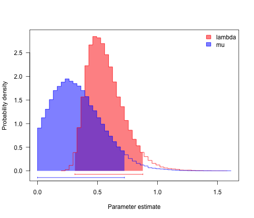
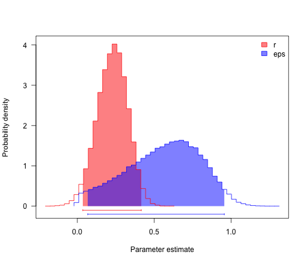
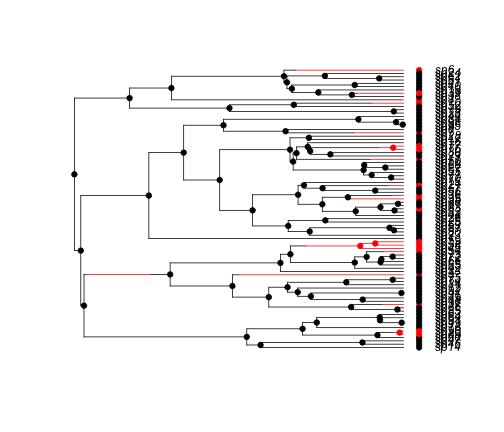
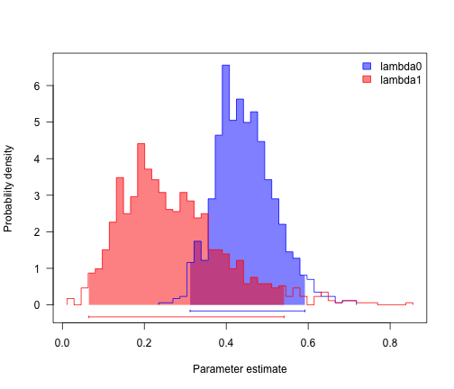
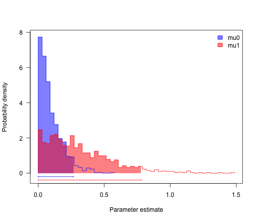

Diversification models
========================================================

We will now study diversification models, including birth-death models and models where diversification rates depend on characters.

<h1> Diversification models </h1>

We can start by considering a very simple model, the pure-birth model. Under a pure-birth model, lineages accumulate by speciation (there is no extinction) at a constant per-lineage rate lambda.


```r
library(ape)
library(TreeSim)
```

```
## Loading required package: geiger
```

```r
library(diversitree)
```

```
## Loading required package: deSolve
## Loading required package: subplex
## Loading required package: Rcpp
```

```r
library(laser)

# We can use TreeSim to simulate a tree under a pure birth model we will use
# TreeSim and, for now, simulate trees of a fixed age (but varying numbers
# of taxa)

simTree1 <- sim.bd.age(age = 10, numbsim = 1, lambda = 0.4, mu = 0)[[1]]
plot(simTree1)
```

 

```r

# notice that if we repeat this command we get a different tree

simTree2 <- sim.bd.age(age = 10, numbsim = 1, lambda = 0.4, mu = 0)[[1]]
plot(simTree2)
```

 

```r

# the pattern of lineage accumulation through time for a tree can be
# visualized with a Lineage-through-time plot

ltt.plot(simTree1)
```

 

```r
# ok - but we should always log the y-axis for ltt plots
ltt.plot(simTree1, log = "y")
```

 

```r

ltt.plot(simTree2, log = "y")
```

 

```r

# What is the distribution of tree size under a pure-birth model?
ntips <- numeric(1000)
for (i in 1:1000) {
    st <- sim.bd.age(age = 10, numbsim = 1, lambda = 0.4, mu = 0)[[1]]
    # rarely, there will be only one tip, and the function will return '1'
    if (length(st) == 1) 
        ntips[i] <- 1 else ntips[i] <- length(st$tip.label)
}

hist(ntips)
```

 


It is worth showing the shape of LTT plots under a pure-birth model. To simplify this, we can fix both the age of the clade and the number of taxa. To make this work with TreeSim, we should choose a value of lambda that satisfies the expected relationship under a pure-birth model, E[n(t)] = 2 exp(lambda * t). So if we choose t = 10 and lambda = 0.4, as above, then E[N(t)] = 2 exp(0.4 * 10) = about 109 tips.


```r

allTheTrees <- sim.bd.taxa.age(n = 109, numbsim = 1000, lambda = 0.4, mu = 0, 
    age = 10, mrca = T)

ltt.plot(allTheTrees[[1]], log = "y")
for (i in 2:1000) {
    ltt.lines(allTheTrees[[i]])
}
```

 


So, under a pure-birth model, we expect the lineage-through-time plot to be linear on a log scale. What if we add extinction?


```r

allTheTrees2 <- sim.bd.taxa.age(n = 109, numbsim = 1000, lambda = 2, mu = 1.6, 
    age = 10, mrca = T)

ltt.plot(allTheTrees2[[1]], log = "y")
for (i in 2:1000) {
    ltt.lines(allTheTrees2[[i]])
}
```

 


Extinction leaves a signature in the shape of phylogenetic trees. We can see that in the lineage-through-time plot, which bends up towards the present day. We can also see this in the trees themselves:


```r

simTree1 <- sim.bd.taxa.age(n = 109, age = 10, numbsim = 1, lambda = 0.4, mu = 0)[[1]]
simTree2 <- sim.bd.taxa.age(n = 109, age = 10, numbsim = 1, lambda = 2, mu = 1.6)[[1]]

par(mfcol = c(1, 2))
plot(simTree1, main = "Pure Birth")
plot(simTree2, main = "Birth-death")
```

 


One important thing to keep in mind with diversification rate analysis is that sampling can be critical. To see why, let's use simulations of partially sampled data:


```r

simTree1 <- sim.bd.taxa.age(n = 109, age = 10, numbsim = 1, lambda = 0.4, mu = 0)[[1]]
simTree2 <- sim.bd.taxa.age(n = 50, age = 10, numbsim = 1, lambda = 0.4, mu = 0, 
    frac = 50/109)[[1]]

par(mfcol = c(1, 2))
plot(simTree1, main = "Fully sampled")
plot(simTree2, main = "Partially sampled")
```

 


```r
# what is the general pattern?

allTheTrees3 <- sim.bd.taxa.age(n = 50, numbsim = 1000, lambda = 0.4, mu = 0, 
    age = 10, mrca = T, frac = 50/109)
plot.new()
ltt.plot(allTheTrees3[[1]], log = "y")
for (i in 2:1000) {
    ltt.lines(allTheTrees3[[i]])
}
```

 


<h1> Estimating speciation and extinction rates </h1>

We can estimate speciation and extinction rates from phylogenetic trees by fitting the models described above, pure-birth and birth-death. We will use diversitree so that we can start to figure out how it works.


```r

simTree1 <- sim.bd.age(age = 10, numbsim = 1, lambda = 0.4, mu = 0)[[1]]

# first fit a Yule model
pbModel <- make.yule(simTree1)
pbMLFit <- find.mle(pbModel, 0.1)

# next fit a Birth-death model
bdModel <- make.bd(simTree1)
bdMLFit <- find.mle(bdModel, c(0.1, 0.05), method = "optim", lower = 0)

# compare models
anova(bdMLFit, pure.birth = pbMLFit)
```

```
##            Df lnLik   AIC ChiSq Pr(>|Chi|)
## full        2  39.4 -74.7                 
## pure.birth  1  38.7 -75.3  1.43       0.23
```

```r

```


The beauty of diversitree is that we can very easily run a Bayesian analysis of diversification rates. 


```r

bdSamples <- mcmc(bdModel, bdMLFit$par, nsteps = 1e+05, lower = c(0, 0), upper = c(Inf, 
    Inf), w = c(0.1, 0.1), fail.value = -Inf, print.every = 10000)
```

```
## 10000: {0.7066, 0.4345} -> 38.23901
## 20000: {0.6983, 0.4807} -> 38.61153
## 30000: {0.4707, 0.1993} -> 39.34786
## 40000: {0.3968, 0.0109} -> 38.59093
## 50000: {0.5818, 0.5375} -> 37.45965
## 60000: {0.7548, 0.3742} -> 36.23272
## 70000: {0.5073, 0.2229} -> 39.27743
## 80000: {0.7477, 0.5798} -> 38.32425
## 90000: {0.4992, 0.2517} -> 39.36961
## 100000: {0.4649, 0.2432} -> 39.27638
```

```r

postSamples <- bdSamples[c("lambda", "mu")]
profiles.plot(postSamples, col.line = c("red", "blue"), las = 1, legend = "topright")
```

 

```r

# often estimates of r (= lambda-mu) are more precise than either lambda and
# mu
postSamples$r <- with(bdSamples, lambda - mu)
postSamples$eps <- with(bdSamples, mu/lambda)

profiles.plot(postSamples[, c("r", "eps")], col.line = c("red", "blue"), las = 1, 
    legend = "topright")
```

 


<h1> Testing for slowdowns </h1>

We can test for slowdowns in the rate of diversification through time using both Pybus and Harvey's gamma - a very common test in the literature - and likelihood using Rabosky's approach.

We can start with gamma:


```r

# let's try our simulated tree
gs <- gammaStat(simTree1)
mccrResult <- mccrTest(CladeSize = length(simTree1$tip.label), NumberMissing = 0, 
    NumberOfReps = 1000, ObservedGamma = gs)

# now let's try the anole tree. This tree is incomplete, so we have to
# account for that.
gsAnole <- gammaStat(anoleTree)
```

```
## Error: object 'anoleTree' not found
```

```r
mccrResultAnole <- mccrTest(CladeSize = length(anoleTree$tip.label), NumberMissing = 70, 
    NumberOfReps = 1000, ObservedGamma = gsAnole)
```

```
## Error: object 'anoleTree' not found
```

```r

# we can use likelihood to compare a set of models for diversification. This
# REQUIRES a complete tree, which we do not have - so these results are
# incorrect

anoleBTimes <- sort(branching.times(anoleTree), decreasing = T)
```

```
## Error: object 'anoleTree' not found
```

```r
fitdAICrc(anoleBTimes, modelset = c("pureBirth", "bd", "DDX", "DDL", "yule2rate"), 
    ints = 100)
```

```
## Error: object 'anoleBTimes' not found
```


<h1> Relating diversification rates to character state </h1>

We can test for a relationship between character state and diversification rates using BiSSE (and related approaches). The syntax for BiSSE is consistent with other aspects of diversitree that we learned above. We will try this with anole ecomorph data. BiSSE can only handle binary traits, so we will have to change our data over to a binary (0-1) character.


```r

# let's try a simulated data set to see if we can really detect a true
# effect

simPars <- c(0.4, 0.2, 0.05, 0.05, 0.05, 0.05)
set.seed(3)
simBisseData <- tree.bisse(simPars, max.t = 14, x0 = 0)

hist <- history.from.sim.discrete(simBisseData, 0:1)
plot(hist, simBisseData)
```

 

```r

nbModel <- make.bisse(simBisseData, simBisseData$tip.state)
p <- starting.point.bisse(simBisseData)
nbModelMLFit <- find.mle(nbModel, p)

rbind(real = simPars, estimated = round(coef(nbModelMLFit), 2))
```

```
##           lambda0 lambda1  mu0  mu1  q01  q10
## real          0.4    0.20 0.05 0.05 0.05 0.05
## estimated     0.4    0.23 0.00 0.47 0.14 0.00
```

```r

# we can test a constrained model where the character does not affect
# diversification rates

cnbModel <- constrain(nbModel, lambda1 ~ lambda0)
cnbModel <- constrain(cnbModel, mu1 ~ mu0)

cnbModelMLFit <- find.mle(cnbModel, p[c(-1, -3)])

# compare models

anova(nbModelMLFit, constrained = cnbModelMLFit)
```

```
##             Df lnLik AIC ChiSq Pr(>|Chi|)
## full         6  -212 437                 
## constrained  4  -214 436  2.63       0.27
```

```r

# let's try a Bayesian analysis

prior <- make.prior.exponential(1/(2 * 0.4))

# this is not long enough but ok for now. You might want more like 1000000
# generations.
mcmcRun <- mcmc(nbModel, nbModelMLFit$par, nsteps = 1000, prior = prior, w = 0.1, 
    print.every = 100)
```

```
## 100: {0.4764, 0.2365, 0.1580, 0.4976, 0.1726, 0.0994} -> -214.90686
## 200: {0.5063, 0.2716, 0.0322, 0.2143, 0.1433, 0.2130} -> -215.33748
## 300: {0.5721, 0.5181, 0.4216, 0.1710, 0.1484, 0.6746} -> -219.73947
## 400: {0.4758, 0.1728, 0.0528, 0.0562, 0.1831, 0.4297} -> -214.32404
## 500: {0.4167, 0.4111, 0.0252, 0.5534, 0.2293, 0.4296} -> -215.97337
## 600: {0.2608, 0.3070, 0.0342, 0.2933, 0.2619, 0.3821} -> -222.18071
## 700: {0.4375, 0.7609, 0.1531, 0.5333, 0.8031, 2.9827} -> -225.98707
## 800: {0.4527, 0.1641, 0.3006, 0.3028, 0.0885, 0.0087} -> -218.23327
## 900: {0.4327, 0.2812, 0.1906, 0.1734, 0.1400, 0.3540} -> -215.15756
## 1000: {0.4310, 0.2367, 0.0852, 0.4269, 0.1284, 0.0251} -> -213.39588
```

```r

col <- c("blue", "red")
profiles.plot(mcmcRun[, c("lambda0", "lambda1")], col.line = col, las = 1, legend = "topright")
```

 

```r
profiles.plot(mcmcRun[, c("mu0", "mu1")], col.line = col, las = 1, legend = "topright")
```

 

```r

# looks like speciation rate differs, but not extinction. can we confirm?
sum(mcmcRun$lambda0 > mcmcRun$lambda1)/length(mcmcRun$lambda1)
```

```
## [1] 0.875
```

```r
sum(mcmcRun$mu0 > mcmcRun$mu1)/length(mcmcRun$mu1)
```

```
## [1] 0.212
```


<h1> Challenge problem </h1>

Repeat the above analyses with anoles (using the trait below). Fit a BiSSE model using both ML and Bayesian methods. What do you conclude?

You need a binary trait, so use the following:


```r


anoleData <- read.csv("~/Documents/teaching/revellClass/2014bogota/continuousModels/anolisDataAppended.csv", 
    row.names = 1)
anoleTree <- read.tree("~/Documents/teaching/revellClass/2014bogota/continuousModels/anolis.phy")

ecomorph <- anoleData[, "ecomorph"]
names(ecomorph) <- rownames(anoleData)

isTG <- as.numeric(ecomorph == "TG")
names(isTG) <- names(ecomorph)
isTG
```

```
##            ahli         alayoni         alfaroi        aliniger 
##               1               0               0               0 
##        allisoni         allogus   altitudinalis         alumina 
##               0               1               0               0 
##       alutaceus     angusticeps     argenteolus     argillaceus 
##               0               0               0               0 
##         armouri   bahorucoensis        baleatus        baracoae 
##               1               0               0               0 
##       barahonae        barbatus        barbouri        bartschi 
##               0               0               0               0 
##         bremeri        breslini    brevirostris        caudalis 
##               1               1               0               0 
##       centralis  chamaeleonides    chlorocyanus     christophei 
##               0               0               0               0 
##       clivicola     coelestinus        confusus           cooki 
##               0               0               1               1 
##    cristatellus    cupeyalensis         cuvieri    cyanopleurus 
##               1               0               0               0 
##         cybotes     darlingtoni       distichus dolichocephalus 
##               1               0               0               0 
##       equestris      etheridgei   eugenegrahami       evermanni 
##               0               0               0               0 
##         fowleri         garmani         grahami           guafe 
##               0               0               0               1 
##       guamuhaya         guazuma       gundlachi       haetianus 
##               0               0               1               1 
##      hendersoni      homolechis           imias    inexpectatus 
##               0               1               1               0 
##       insolitus        isolepis           jubar           krugi 
##               0               0               1               0 
##      lineatopus   longitibialis        loysiana          lucius 
##               1               1               0               0 
##    luteogularis      macilentus        marcanoi          marron 
##               0               0               1               0 
##         mestrei       monticola          noblei        occultus 
##               1               0               0               0 
##         olssoni        opalinus      ophiolepis        oporinus 
##               0               0               0               0 
##        paternus        placidus       poncensis        porcatus 
##               0               0               0               0 
##          porcus      pulchellus         pumilis quadriocellifer 
##               0               0               0               1 
##      reconditus        ricordii     rubribarbus          sagrei 
##               0               0               1               1 
##    semilineatus        sheplani         shrevei      singularis 
##               0               0               1               0 
##      smallwoodi         strahmi       stratulus     valencienni 
##               0               1               0               0 
##       vanidicus    vermiculatus        websteri       whitemani 
##               0               0               0               1
```

